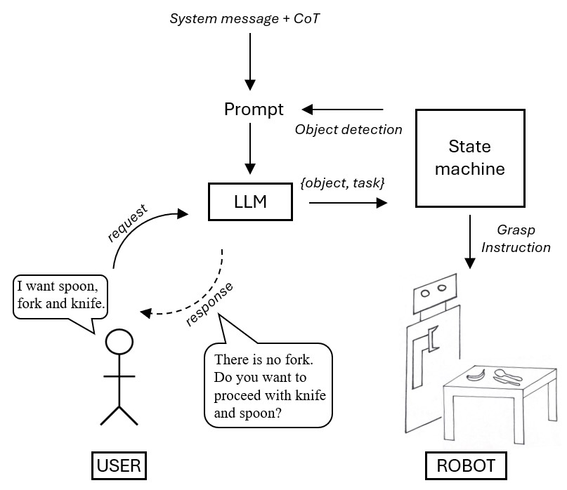

<div align="center">

</div>

# IDRA-H

Intelligent Dialogue for Robot Applications with Humans: a system pipeline for intutitive dialogue between a user and a robot through the invovlement of LLMs.

## How to run on Toyota HSR (with-ROS)

1. Make sure the state machine is running and the HSR is connected.
2. Before running the code, make sure to adjust the shell script. 
3. Source the shell script.

```
source ros_entrypoint.sh 
```

4. Start roslaunch server.
```
roslaunch launch/with-ROS__as.launch
```

5. Start your experience with IDRA-H.

NOTE: The interaction with the HSR pipeline can also be adjused to run with models through Ollama.


## How to run only the dialogue, without the connection to the robot (without-ROS)
### There are two ways to run with IDRA-H

#### with models GPT3.5 or GPT-4o from OpenAI

1. Make sure to set the variable for your API key.

```
echo 'export OPEN_API_KEY="<your-api-key>"' >> ~/.bashrc
source ~/.bashrc
```
2. If required, adjust the `model` in openai_rest_api.py.

3. Run the code and start your dialogue with IDRA-H.

```
python3 openai_rest_api.py
```


#### with models LLama 3 and Mixtral through Ollama

1. If required, adjust the `model` in ollama_rest_api.py.

2. Adjust the variable `TU_Wien` in ollama_rest_api.py.
- it is meant to be `False`, if you are running Ollama on your localhost.
- It is meant to be `True` if you ping to another host. If so, you need to adjust the IP address of the host.

3. Make sure Ollama is running with the desired model.

```
docker start <your_ollama_container>
docker exec -it <your ollama_container> bash
```

4. 3. Run the code and start your dialogue with IDRA-H.

```
python3 ollama_rest_api.py
```
